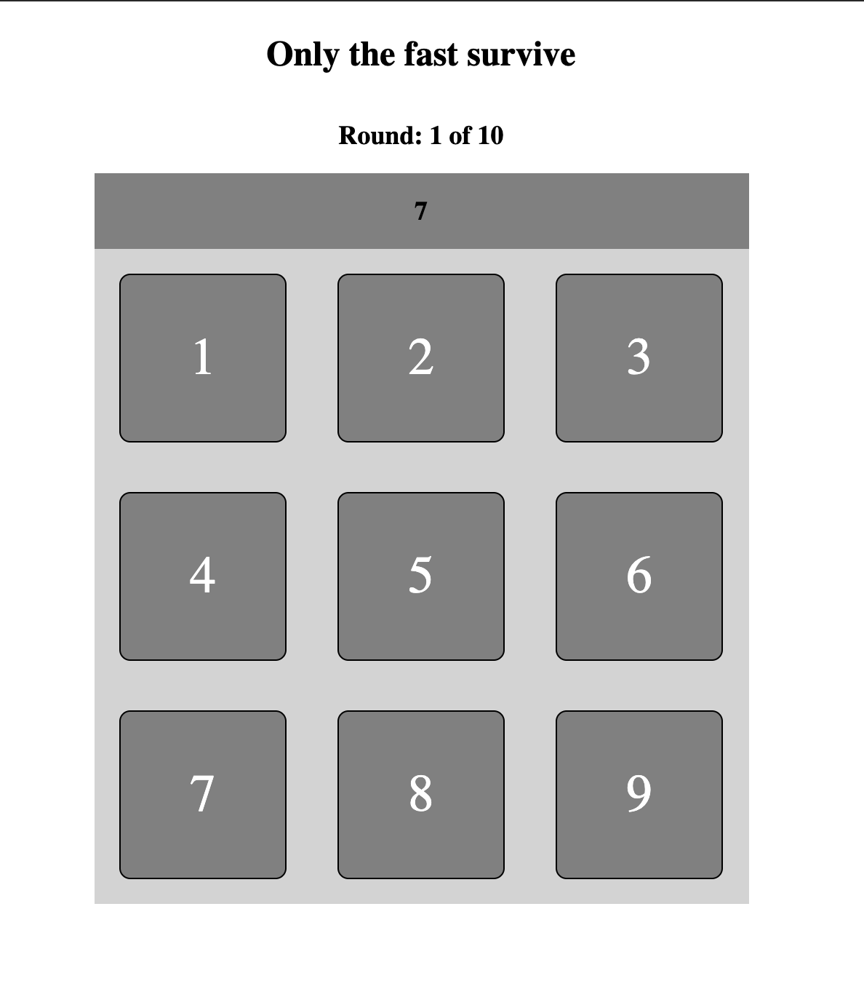

# Defuse or Lose (A Simon Game)
By Matthew Millheim

[Link to Play this Game on Github Pages](https://mmillheim.github.io/memory-tester/)

---

## Introduction and Description
---
### How to run the game:
This game is played in the browser and can be access via Github Pages

[Link to Play this Game on Github Pages](https://mmillheim.github.io/memory-tester/)

### How the game is played:
At the beginning of the each round, the keys will highlight in a pattern. The pattern length will be the same as the round number (e.g. In Round 1 there is 1 key in the pattern. In Round 2 there will be 2 keys in the pattern.). After the pattern displays, the timer will start, and the user must replicate the pattern to complete the round. 

The game is over if... 
- the user clicks on the wrong key, or 
- the timer reaches zero before the user completes the pattern.

The game is won by successfully completing all rounds before the timer reaches zero.

Additional Details:
- Every time the user completes a round some time is added to the timer.
- While the pattern is being displayed, the user will not be able to enter the pattern into the keypad.

## Design
---
### User Stories:
As part of the of design process I created user stories to frame up what capabilities I would like to add to the game. They are divided into *Minimum Viable Product (MVP)* and *Stretch Goals*. My assumption going into designing this game was that the user would be able to read English (no localization yet for the game title and instructions) and that they would generally be 12-years-old or older. 

#### MVP:
- As a player, I will need to be presented with instructions so I know how to play the game.
- As a player, I will need to be able to trigger the start of the game so the timer does not start before I am ready.
- As a player, I will need to know the pattern that I need to repeat so I can play the game.
- As a player, I will need to be able to reproduce pattern by clicking on the screen so that I can participate in the game.
- As a player, I will need the timer to be displayed prominently on the screen so I know how much time I have (it will also add to the sense of urgency).
- As a player, I will need the game to recognize when a correct pattern has been entered so I know whether I have successfully completed the round.
- As a player, I will need the game to recognize an incorrect pattern so I know if/when I have lost the round.
- As a player, I would like the UI to fit the story (a bomb with a countdown that I need to diffuse) so I feel more engaged

#### Stretch Goals:
- As a player, I will need to timer to get more time, after I successfully complete the pattern so I can continue playing.
- As a player, I would like there to be selectable difficulty levels so I can start easier and work my way up to hard mode.
- As a player, I would also like to be able to use a keyboard to enter the pattern because this will be quicker than a mouse.
- As a player, I would like if there is a countdown sound when I get close to the end of time so I both know when I am nearly out of time and so I'm more engaged.
- As a player, I would like the game to keep score so I can try to beat my previous best game.
- As a player, I would like if there is an animation when I win or lose to add to the sense of accomplishment.

### Initial Mockup:
Below are some initial mockups I drew up in Illustrator:

Mockup of the interface:

Mockup showing the keys highlighting to display the pattern for the user to replicate:

## Development Process
This game was written in Javascript, HTML, and CSS...

### Technologies Used
I used the following technologies to build this game...
- ***HTML*** for the user interface
- ***CSS*** for styling
- ***Javascript*** for game logic and interaction

### First Draft
Here are a few images of how the game looked when I initially wrote the game logic.
#### Easy Mode:

#### Hard Mode:

### Game Over Screen:

### Refinement
I later looked for some design inspiration and found some interesting examples on how to add a 3D effect to elements using CSS box shadows...

### Unsolved Problems and Next Steps
At the time that I turned in this project as part of the Bootcamp I was participating in at General Assembly, I did not complete all of my stretch goals. 

I also struggled with the styling. I would like to improve my craft in this area. 

When I update this app I will focus on...
- Making the game more mobile-friendly
- Refining the interface and code to make the UI a bit faster
- Adding sound effects with a mute button (I will default to muted) for the last 5 seconds of the timer countdown sequence.
- Adding animation for the victory and game over condtions
- Improve overall styling by adding adding a background image and styling the menus and text
- Adding localization
